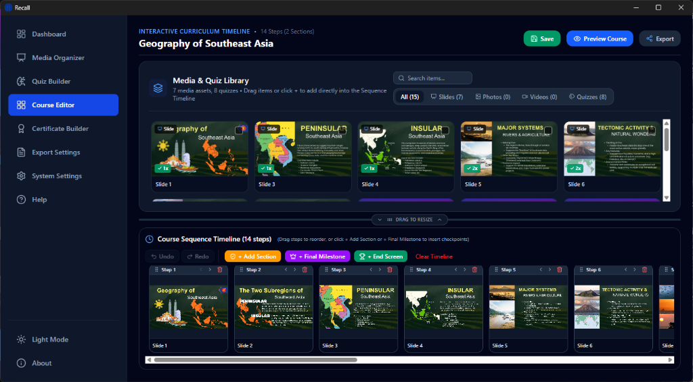

<div align="center">
  
  <h1>Recall</h1>
  <p><strong>Modern, Cross-Platform Offline E-Learning Authoring Suite & Interactive Course Player</strong></p>
</div>

<p align="center">
  
</p>

**Recall** is an authoring desktop application built with **Tauri v2**, **React 19**, **TypeScript**, and **Rust**. Designed for educators, trainers, and curriculum designers, Recall lets you build interactive multimedia lessons, configure 12 interactive assessment formats, manage sequenced curriculums with mastery gates, and issue verifiable Certificates of Completion with offline QR code verification.

---

## ✨ Key Features

### 🎬 Media & Slide Organizer
- **PowerPoint Ingestion (`.pptx`)**: Direct conversion and slide extraction using Microsoft PowerPoint (via COM on Windows) or LibreOffice (headless on Linux & macOS), plus a fallback standalone parser.
- **Rich Media Catalog**: Import and organize slides, photos, audio, and videos with instant thumbnail rendering and tagging.
- **Batch Processing**: Multi-select assets for bulk addition or removal from course tracks.

### 🧠 Quiz Builder Studio (12 Interactive Question Types)
- **Categorization**: Sort randomized terms or items into predefined category buckets.
- **Click an Image (Hotspot)**: Interactive visual challenge to locate and click regions on diagrams, maps, or anatomy images.
- **Connect the Dots**: Drag-and-drop matching between pairs across columns.
- **Dropdown Select**: Inline contextual selector to pick correct answers in sentences or equations.
- **Enumeration**: Input items in any order with configurable tolerance, synonyms, and casing rules.
- **Essay**: Open-ended long-form response with scoring rubrics and manual teacher grading.
- **Identification**: Direct term recall with synonym support.
- **Multiple Choice**: Single best answer from randomized options with per-page question navigation.
- **Multiple Response**: Multi-select checkboxes with partial credit grading support.
- **Numeric & Equation**: Evaluates mathematical expressions, fractions, decimals, and equivalent formulas.
- **Sequencing**: Chronological and logical ordering using full-box drag-and-drop or stepper controls.
- **True or False**: Statement evaluation with Traditional and Modified (word replacement) modes.

### 📐 Course Organizer & Interactive Timeline
- **Fluid Multi-Pane Layout**: Draggable, persistent horizontal resizer between the Media Library (top) and Sequence Timeline (bottom) with double-click reset and quick collapse/expand arrows.
- **Adaptive Single-Screen Scaling**: Dynamically expands to fill any window dimension and gracefully switches to scrolling when below minimum comfortable thresholds.
- **Section Milestones & Final Capstone**: Insert checkpoints requiring configurable passing percentages (e.g. 75%) before students can advance.
- **History Tracking**: Full multi-level Undo & Redo (`Ctrl+Z` / `Ctrl+Y`) with filmstrip right-click context actions.
- **Asset Usage Indicators**: Automatic badges showing which library items have been used in the active curriculum.

### 🎓 Certificate Builder & Offline Verification
- **Multiple Design Templates**: 10 clean, customizable certificate templates with live preview.
- **Flexible Paper Formats**: Instant switching between A4, US Letter, and A5 in both Portrait and Landscape orientations.
- **Offline QR Code Payload Verification**: Embeds cryptographic verification data into a QR code that can be scanned and verified offline by any standard camera without internet access.
- **Direct PDF Export**: Print or export certificates to PDF with high-resolution vector output.

### 🚀 Self-Contained HTML5 Course Export
- Export complete interactive courses into a standalone, single-file HTML5 bundle that learners can launch in any modern web browser without installing additional software.

---

## 💻 Cross-Platform Support

Recall is engineered for cross-platform performance and desktop environment integration:

| Operating System | Desktop Environment | Key Integrations |
| :--- | :--- | :--- |
| **Windows** | Windows 10 & 11 | Native file association (`.recall`), PowerPoint COM automation, NSIS installer |
| **Linux** | **KDE Plasma** & **GNOME** | FreeDesktop shared MIME (`application/x-recall`), hicolor icon themes, `xdg-open`, LibreOffice headless detection |
| **macOS** | macOS 11+ | Native window styling, retina rendering, Apple Silicon & Intel universal binaries |

---

## 🛠️ Tech Stack

- **Desktop Framework**: [Tauri v2](https://v2.tauri.app/) (Rust backend)
- **Frontend Core**: [React 19](https://react.dev/), [TypeScript](https://www.typescriptlang.org/), [Vite](https://vitejs.dev/)
- **Styling**: [Tailwind CSS v4](https://tailwindcss.com/)
- **Icons**: [Lucide React](https://lucide.dev/)
- **Animations**: [Motion](https://motion.dev/)
- **Bundler & Utilities**: [esbuild](https://esbuild.github.io/), [JSZip](https://stuk.github.io/jszip/), [QRCode](https://github.com/soldair/node-qrcode), [Dexie.js](https://dexie.org/)

---

## 🚀 Getting Started

### Prerequisites

1. **Node.js** (v18.0 or higher)
2. **Rust & Cargo** (1.77.2 or higher): [Install Rust](https://www.rust-lang.org/tools/install)
3. **Platform Dependencies**:
   - **Linux (Debian/Ubuntu)**:
     ```bash
     sudo apt-get update
     sudo apt-get install -y libwebkit2gtk-4.1-dev build-essential curl wget file libxdo-dev libssl-dev libayatana-appindicator3-dev librsvg2-dev
     ```
   - **Linux (Fedora)**:
     ```bash
     sudo dnf install webkit2gtk4.1-devel openssl-devel curl wget file
     ```
   - **Windows**: [Microsoft C++ Build Tools](https://visualstudio.microsoft.com/visual-cpp-build-tools/) & WebView2 (pre-installed on Win 10/11).
   - **macOS**: Xcode Command Line Tools (`xcode-select --install`).

---

### Installation & Development

```bash
# 1. Clone the repository
git clone https://github.com/your-username/recall.git
cd recall

# 2. Install dependencies
npm install

# 3. Launch in development mode with hot-reloading
npm run tauri dev
```

To run only the web frontend in your browser:
```bash
npm run dev
```

---

### Production Build & Packaging

To compile a production release:

```bash
# Builds the standalone player engine bundle, Vite assets, and Tauri binary
npm run tauri build
```

The compiled bundles will be generated in `src-tauri/target/release/bundle/`:
- **Windows**: `.msi` (WiX) and `.exe` (NSIS installer)
- **Linux**: `.deb` package and standalone `.AppImage`
- **macOS**: `.dmg` and `.app` bundle

---

## ⌨️ Keyboard Shortcuts

| Shortcut | Action |
| :--- | :--- |
| `Ctrl+S` / `Cmd+S` | Save active project |
| `Ctrl+Shift+S` / `Cmd+Shift+S` | Save project As... |
| `Ctrl+Z` / `Cmd+Z` | Undo timeline action |
| `Ctrl+Y` / `Cmd+Shift+Z` | Redo timeline action |
| `Double Click` (on resizer) | Reset Library/Timeline split to default (315px) |

---

## 📄 License

This project is open-source software developed by **Z Software Labs** and is licensed under the [MIT License](LICENSE).
